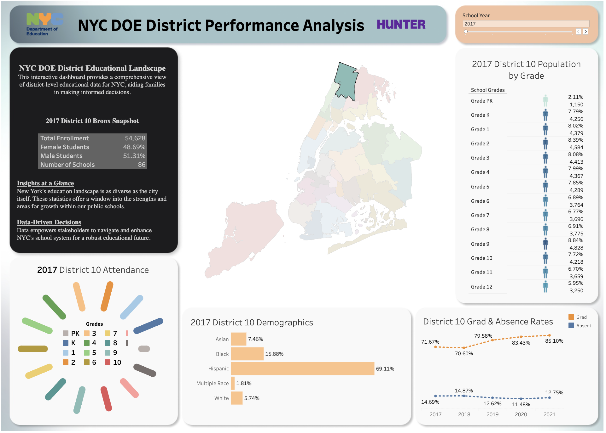
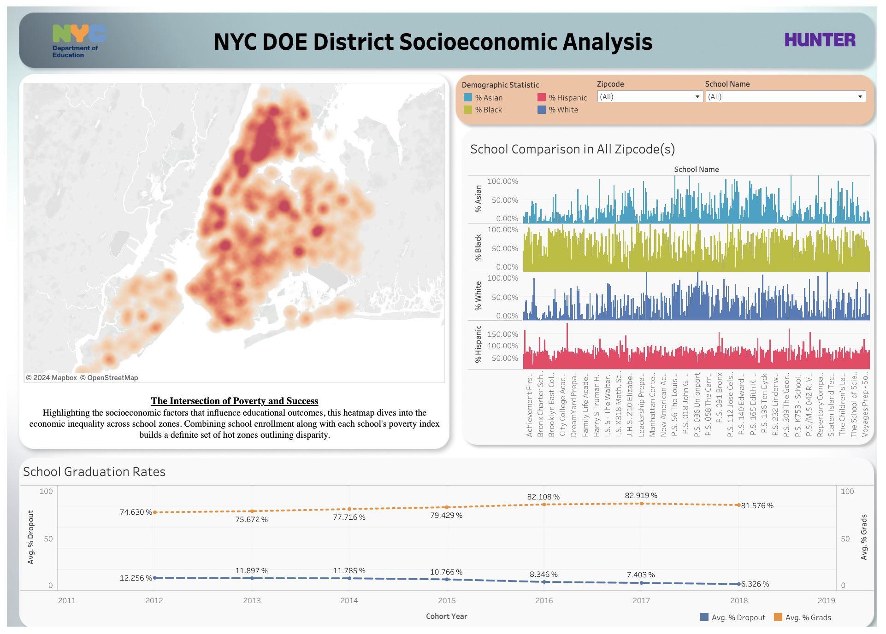

# NYC DOE Dashboard

## Introduction
This is my final project for Data Analytics class. This project visualizes data from NYC DOE public schools using Tableau. Dashboards: District Level, and Socioeconomic Analysis. Data was sourced from NYC Open Data, including grades, attendance, graduation and dropout rates, and demographics.

[Demo](https://public.tableau.com/views/NYCDistrictandSchoolInsights/FinalDistrictLevelDashboard)

## Technology Stack
- **Visualization**: Tableau
- **Geospatial Data Handling**: Integration of geographical data for precise mapping
- **Interactive Dashboards**: Tableau's interactive features and filters
  
## Methodology
Data was collected, cleaned, and integrated datasets using district numbers and school names. Geometrical data for districts and school locations provided spatial context.

## Dashboards

### District Level Dashboard
- **Visual Representation**: Unique colors for each district on a map.
- **Data Presentation**: Enrollment, attendance rates, and demographic breakdowns.
- **Visualization Tools**: Text tables, bar graphs, line graphs, and a color-coded grade distribution table.

### Socioeconomic Analysis Dashboard
- **Heatmap**: Poverty indices and racial demographics.
- **Data Presentation**: Enrollment data, graduation, and dropout rates (2012-2018).
- **Filtering Options**: Filter by ZIP code and school for detailed views.

